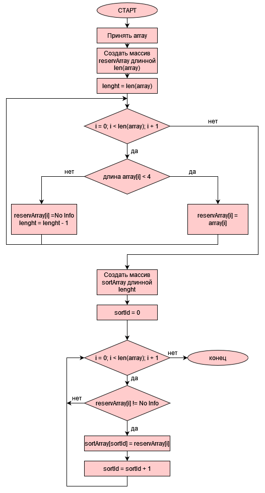

# Задача
**Создать программу, принимающую массив строк и формирующую новый массив со всеми строками из первого массива дниной не длинне трёх символов.**

# Алгоритм программы
1) Принимаем информацию от пользователя в список с помощью функции [Input](#input) в массив array
2) Сортируем array c помощью функции [SortArrayLessThree](#sortarraylessthree) в массив sortArray
3) Выводим аrray и sortArray с помощью функции [WriteStringArray](#writestringarray)
# Функции
## Input
**Функция возвращает массив строк заданных пользователем**
1. Функция принимает от пользователя число элементов в массиве. 
2. После этого принимаются элементы массива. 
3. Функция возвращает сформированный массив.
## WriteStringArray
**Функция принимает массив строк и выводит его в консоль**
## SortArrayLessThree
**Функция принимает массив строк и возвращает массив строк из принятого массива короче 3 символов**
### Блок схема функции

